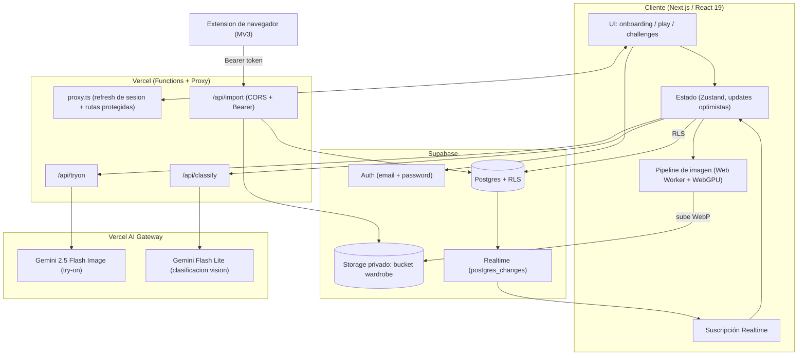
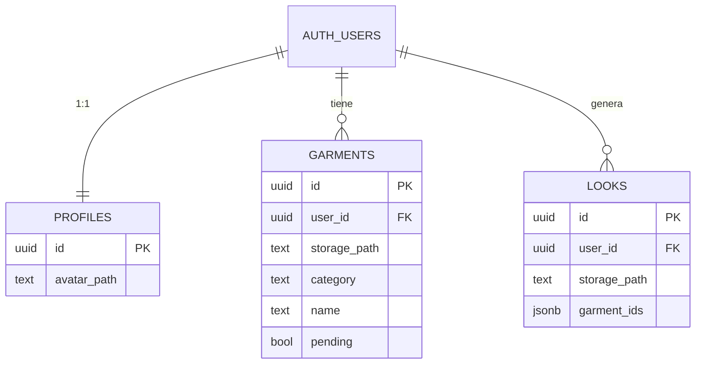
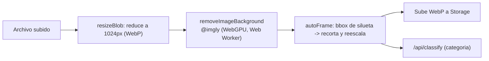
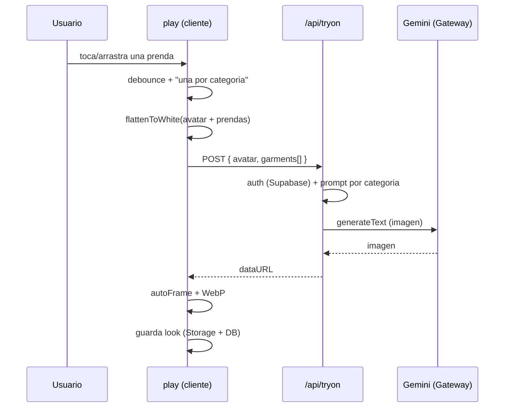
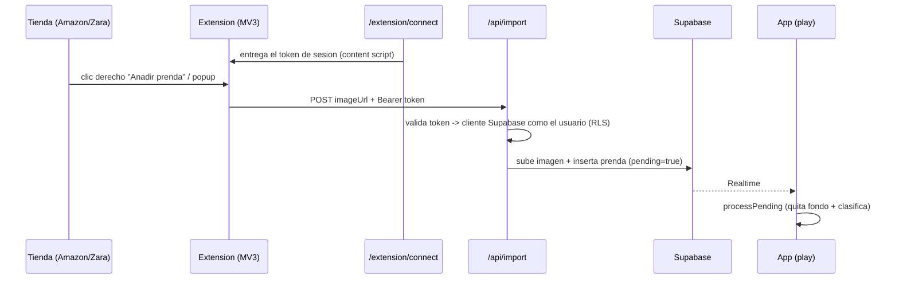

# 🏗️ Arquitectura — Glamour Studio

Probador virtual (virtual try-on) con IA, mobile-first. Este documento describe
los subsistemas, el flujo de datos y las decisiones técnicas detrás del proyecto.

> TL;DR: un cliente Next.js orquesta un **pipeline de imagen que corre en el
> navegador** (quitado de fondo con WebGPU en un Web Worker, normalización de
> encuadre y compresión a WebP), persiste en **Supabase con RLS por usuario**,
> genera looks con **Gemini vía Vercel AI Gateway** mediante un prompt
> determinista por categoría, sincroniza en vivo con **Supabase Realtime** y se
> alimenta de una **extensión de navegador (MV3)** que importa prendas desde
> tiendas online.

---

## 1. Vista general



---

## 2. Stack

| Capa | Tecnología | Notas |
|---|---|---|
| Framework | Next.js 16 (App Router, RSC) + React 19 | `proxy.ts` (antes "middleware") para sesión |
| Estilos | Tailwind v4 + sistema de tokens propio | tema único, escala de radios/sombras |
| Animación | `motion` + `canvas-confetti` | celebraciones, hojas mobile |
| Iconos | `@phosphor-icons/react` | un solo set |
| Auth/DB/Storage/Realtime | Supabase (`@supabase/ssr`, `supabase-js`) | RLS por usuario, URLs firmadas |
| IA | Vercel **AI SDK** + **AI Gateway** | Gemini 2.5 Flash Image + Flash Lite |
| Imagen (cliente) | `@imgly/background-removal` (WebGPU + Worker), Canvas | quitar fondo, encuadre, WebP |
| Estado | Zustand | sin persistencia local; Supabase es la verdad |
| Extensión | Chrome MV3 (service worker + content scripts) | importar prendas de tiendas |

---

## 3. Subsistemas

### 3.1 Autenticación y protección de rutas
- **Supabase Auth** (email + contraseña) vía `@supabase/ssr` con clientes
  separados para navegador (`lib/supabase/client.ts`) y servidor
  (`lib/supabase/server.ts`).
- **`src/proxy.ts`** (convención de Next.js 16) corre en cada request: refresca
  la sesión (cookies) y **protege** `/onboarding` y `/play`; redirige a `/login`
  si no hay sesión, y saca de `/login` si ya la hay.
- Confirmación de email vía `/auth/confirm` (`verifyOtp`).

### 3.2 Modelo de datos y seguridad (RLS)
Postgres con **Row Level Security**: cada usuario solo ve y modifica lo suyo.



- Políticas RLS: `auth.uid() = user_id` en las tablas.
- **Storage privado** (bucket `wardrobe`): política por carpeta
  `(storage.foldername(name))[1] = auth.uid()::text`, de modo que las rutas
  `{user_id}/avatar.webp`, `{user_id}/garments/*`, `{user_id}/looks/*` solo son
  accesibles por su dueño. La UI usa **URLs firmadas** (TTL 1h) para mostrarlas.
- Esquema versionado en [`supabase/schema.sql`](./supabase/schema.sql).

### 3.3 Pipeline de imagen (corre en el navegador)
Todo el procesamiento pesado ocurre **client-side** para abaratar el backend y
proteger la privacidad (las fotos no pasan por nuestro servidor salvo al generar).



- **Quitar fondo**: `@imgly/background-removal` con `device: 'gpu'` (WebGPU, con
  *fallback* a CPU) y `proxyToWorker: true` para no bloquear el hilo principal;
  salida **WebP con transparencia**.
- **`autoFrame`** (`lib/image.ts`): analiza los píxeles, calcula el *bounding
  box* de la silueta (ignora blanco y transparente, con margen de seguridad) y
  **reescala a la persona a una proporción fija** para que el tamaño sea
  consistente entre el avatar y todos los looks.
- **`flattenToWhite`**: compone sobre blanco con *padding* antes de mandar a la
  IA (evita que la transparencia se interprete como negro y ayuda a no recortar).
- **Compresión a WebP** en todo (subidas y resultado de la IA) ~70-80% menos peso
  que PNG, más *lazy-load* en las galerías.

### 3.4 Generación con IA (Vercel AI Gateway)
Dos modelos a través del Gateway (auth por OIDC en local / API key en prod):

- **`/api/tryon`** -> `google/gemini-2.5-flash-image`. Recibe avatar + prendas
  (data URLs), y construye un **prompt determinista según las categorías
  seleccionadas**:
  - *Identity lock*: conservar la cara/identidad del avatar e **ignorar a los
    modelos** que aparezcan en las fotos de las prendas.
  - *Regla del vestido*: si hay vestido y no hay pantalón -> solo el vestido
    (piernas desnudas); si hay ambos -> en capas.
  - *Reemplazo por región*: cambia solo la zona de la prenda; el resto del outfit
    original se conserva.
  - *Encuadre/fondo*: cuerpo completo, fondo blanco uniforme.
- **`/api/classify`** -> `google/gemini-2.5-flash-lite` (visión): clasifica cada
  prenda en una categoría; corre en segundo plano y reacomoda la prenda sola.



- **Auto-generación con *debounce***: cambiar la selección dispara la generación
  sola; si ya hay una en curso, encola la última selección (sin solapar).
- **Selección "una prenda por categoría"** en el store: elegir otra del mismo
  tipo reemplaza la anterior.

### 3.5 Realtime y estado
- **Zustand** mantiene avatar, prendas, looks y selección. Sin persistencia
  local: **Supabase es la fuente de verdad**; los borrados de looks son
  **optimistas** (UI instantánea, *rollback* si falla).
- **Supabase Realtime** (`postgres_changes` sobre `garments`): cuando la
  extensión inserta una prenda, el cliente **re-sincroniza en vivo**. *Fallback*
  por `visibilitychange`/`focus` si no hay Realtime.

### 3.6 Extensión de navegador (Chrome MV3)
Permite **importar prendas desde tiendas** (Amazon, Zara, etc.) con un clic.



- La extensión obtiene el **token de sesión** desde `/extension/connect` y llama
  a `/api/import` con `Authorization: Bearer`. El backend crea un cliente
  Supabase **autenticado como el usuario**, así **respeta RLS** al subir/insertar.
- La prenda entra como `pending=true` (imagen cruda). El cliente la termina con
  `processPending`: quita fondo, clasifica y reemplaza la imagen en Storage.

### 3.7 Modo Historia (motor de retos)
- Motor de reglas **local, sin IA y sin costo** (`lib/challenges.ts`): cada nivel
  define **3 metas progresivas (1-3 estrellas)** evaluadas en vivo contra la
  selección.
- Progreso en **localStorage** expuesto con `useSyncExternalStore` (reactivo, sin
  `setState` en efectos); **desbloqueo progresivo** de niveles y celebración con
  confeti.

---

## 4. Decisiones técnicas (por qué)

| Decisión | Razón |
|---|---|
| Procesar imagen en el cliente (WebGPU + Worker) | Backend barato, privacidad (las fotos no se almacenan en nuestro server), UI fluida |
| WebP en todo | ~70-80% menos peso que PNG, soporta transparencia, carga rápida |
| `autoFrame` por bounding box | La IA varía el encuadre; normalizamos para tamaño consistente |
| `flattenToWhite` antes de la IA | La transparencia se interpreta como negro; el blanco da fondo consistente |
| Prompt determinista por categoría | Resultados predecibles (vestido, capas, identidad) sin depender de "que adivine" |
| RLS + carpetas por usuario + URLs firmadas | Aislamiento real de datos entre usuarias |
| AI Gateway (OIDC local / API key prod) | Un solo punto para modelos, billing y *failover* |
| Importar como `pending` + Realtime | La extensión no procesa imagen; el cliente (con WebGPU) lo hace y se ve al instante |

---

## 5. Mapa del repo

```
src/
  app/
    page.tsx                 # menu de modos (libre / historia)
    login/                   # auth email + password
    onboarding/              # subir foto + prendas (wizard 2 pasos)
    play/                    # probador: vestir + generar + galeria
    challenges/              # modo historia (timeline 3 estrellas)
    extension/connect/       # puente de sesion para la extension
    auth/confirm/route.ts    # confirmacion de email (verifyOtp)
    api/
      tryon/route.ts         # try-on (Gemini 2.5 Flash Image)
      classify/route.ts      # clasificacion de prenda (Gemini Flash Lite)
      import/route.ts        # importar desde la extension (Bearer + RLS)
  components/                # AvatarStage, Wardrobe, HangerRail, LooksSheet, ui...
  lib/
    image.ts                 # resizeBlob, flattenToWhite, autoFrame (WebP)
    bg.ts                    # quitar fondo (WebGPU + Worker)
    data.ts                  # acceso a Supabase (Storage + DB, URLs firmadas)
    store.ts                 # Zustand (optimista, pending, realtime sync)
    challenges.ts            # motor de retos (reglas + estrellas + progreso)
    confetti.ts, clsx.ts, types.ts
    supabase/                # clientes browser/server + proxy de sesion
  proxy.ts                   # refresh de sesion + proteccion de rutas
supabase/schema.sql          # tablas + RLS + bucket + politicas
extension/                   # Chrome MV3 (popup, background, content scripts)
```

---

## 6. Flujo de datos en una frase
Subes fotos -> se procesan en tu navegador (WebGPU) -> se guardan en Supabase con
RLS -> seleccionas prendas -> el cliente compone y llama a Gemini por el AI
Gateway con un prompt determinista -> el resultado se normaliza y se guarda como
look. La extensión inyecta prendas que llegan en vivo por Realtime.
